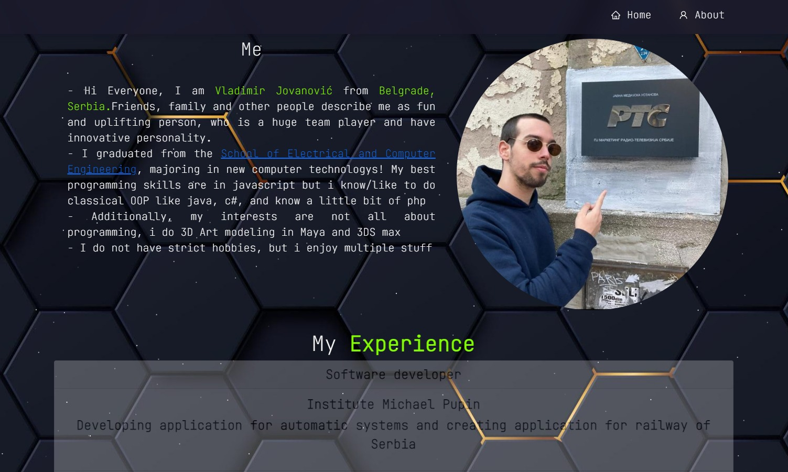

<a name="readme-top"></a>

<br />
<div align="center">
  <a href="https://github.com/TheGoldenCloud/myPortfolio">
    
  </a>

<h3 align="center">My portfolio</h3>

  <p align="center">
    ·
    <a href="https://github.com/TheGoldenCloud/myPortfolio/issues">Report Bug</a>
    ·
    <a href="https://github.com/TheGoldenCloud/myPortfolio/issues">Request Feature</a>
  </p>
</div>


<!-- TABLE OF CONTENTS -->
<details>
  <summary>Table of Contents</summary>
  <ol>
    <li>
      <a href="#about-the-project">About The Project</a>
      <ul>
        <li><a href="#built-with">Built With</a></li>
      </ul>
    </li>
    <li>
      <a href="#getting-started">Getting Started</a>
      <ul>
        <li><a href="#prerequisites">Prerequisites</a></li>
        <li><a href="#installation">Installation</a></li>
      </ul>
    </li>
  </ol>
</details>


<!-- ABOUT THE PROJECT -->
## About The Project

<!-- [![Product Name Screen Shot][product-screenshot]](https://example.com) -->

<!--  -->


Below is personalized project dedicated to showcase and highlight my skills and history employment in my professional journey.  
To view live preview, you can visit: https:/thegoldencloud.github.io/myPortfolio/

<p align="right">(<a href="#readme-top">back to top</a>)</p>


### Built With

[](https://skillicons.dev)
[](https://skillicons.dev)

<p align="right">(<a href="#readme-top">back to top</a>)</p>

## Getting Started

Simple and easy, just follow steps below

### Prerequisites

This is an example of how to list things you need to use the software and how to install them.
* npm
  ```sh
  npm install npm@latest -g
  ```

### Installation

1. Clone the repo
   ```sh
   git clone https://github.com/TheGoldenCloud/myPortfolio.git
   ```
2. Get into app file
   ```sh
   cd myPortfolio
   ```
3. Install NPM packages
   ```sh
   npm install
   ```
4. Start server
   ```sh
   npm start

5. Get into front
   ```sh
   cd myPortfolio

6. Install NPM packages
   ```sh
   npm install
   ```
7. Start app
   ```sh
   npm run dev
   ```

<p align="right">(<a href="#readme-top">back to top</a>)</p>
